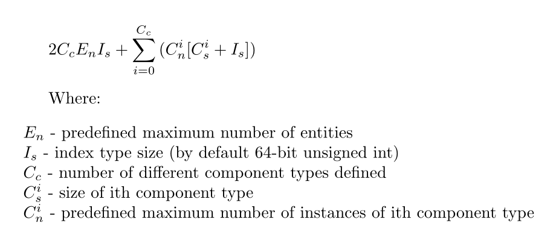

# ecs-prototype
<<<<<<< HEAD
Work in Progress!
Entity-Component System prototype, unsual in that it is designed to work
on preallocated, fixed-size memory as opposed to 'standard' maps-based one.
This could bring benefits in speed of random access to components of entities
as here it's just a index dispatch, rather than map search.
Unfortunatelly my solution comes with some memory overhead so its meant
to be used only for specific cases, posibly with some other system in parallel.
Memory overhead can be calculated with this formula:

=======
prototype of fixed space entity-component system
>>>>>>> 2d3568e5bef3b88ed1486a6e5be02263a8946e91
